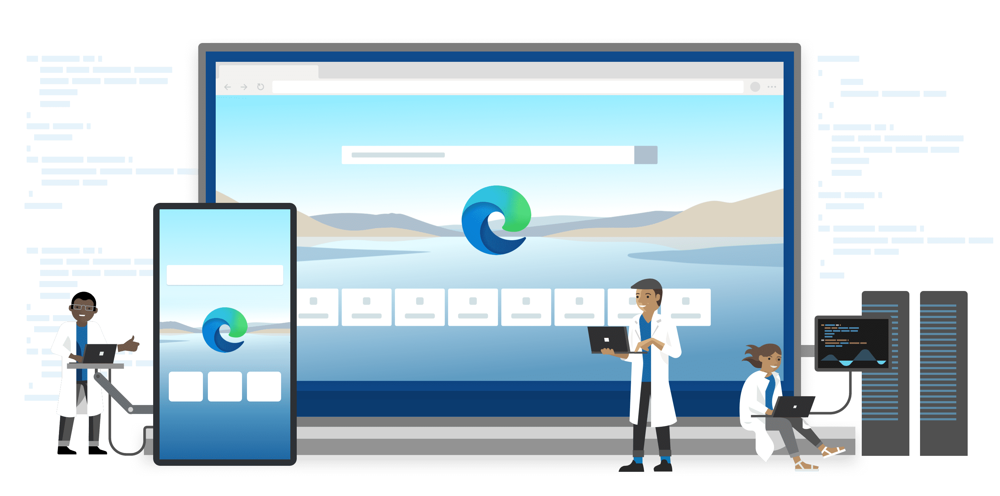
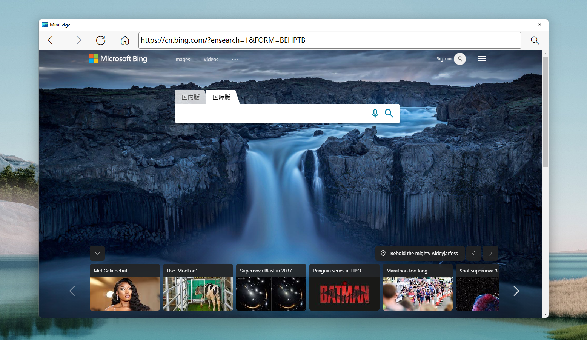

## 什么是Microsoft Edge WebView2

> https://docs.microsoft.com/zh-cn/microsoft-edge/webview2/

`Microsoft Edge WebView2`控件允许在本机应用中**嵌入Web技术(HTML、CSS以及JavaScript)**。`WebView2`控件使用`Microsoft Edge(Chromium)`作为绘制引擎，以在本机应用中显示Web内容。使用WebView2，可以在本机应用的不同部分嵌入Web代码，或在单个WebView实例中生成所有本机应用。

## 相关文章

* [乘风破浪，遇见最美Windows 11之现代Windows桌面应用开发 - Microsoft Edge WebView2](https://www.cnblogs.com/taylorshi/p/15249599.html)

## 屏幕截图

## 发行预览

* [https://github.com/TaylorShi/HelloWebView2/releases](https://github.com/TaylorShi/HelloWebView2/releases)